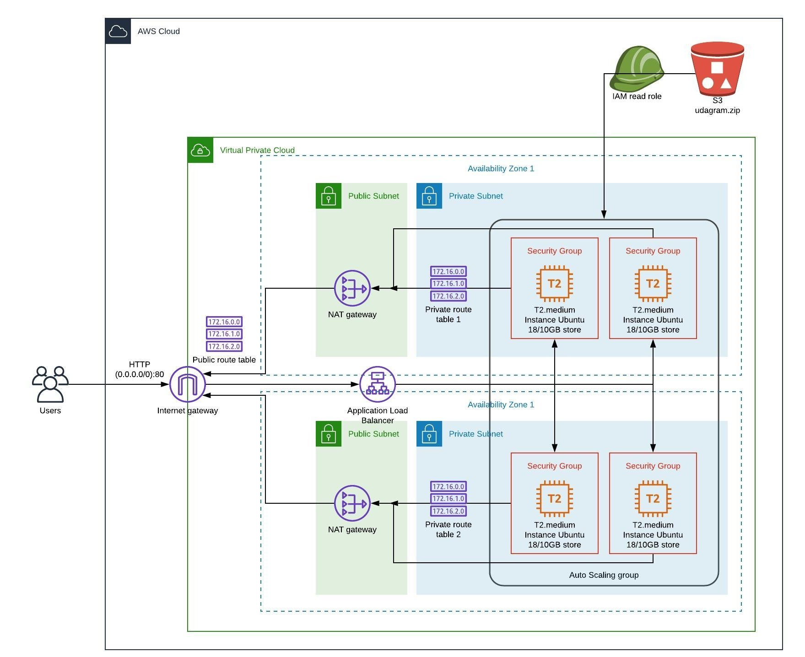

# General

This folder contains solution for Cloud DevOps Nanodegree - Project 2 - Deploy a high-availability web app using CloudFormation

# Infrastructure diagram

AWC cloud infrastructure diagram can be found [here](https://www.lucidchart.com/invitations/accept/880d17f2-7f6c-495d-87d8-842692a9c8c7)

# Content

- create.sh, update.sh, delete.sh - helper AWS CLI scripts that enhanced work ovet this project
- infrastructure.yaml - defines VPC, AZs, Gateway, Subnets, Routing and NAT service
- infrastructure-params.json - input parameters to above YAML file
- servers.yaml - definition of servers EC2,
- servers-params.json - input parameters for servers
- diagram.jpeg 
